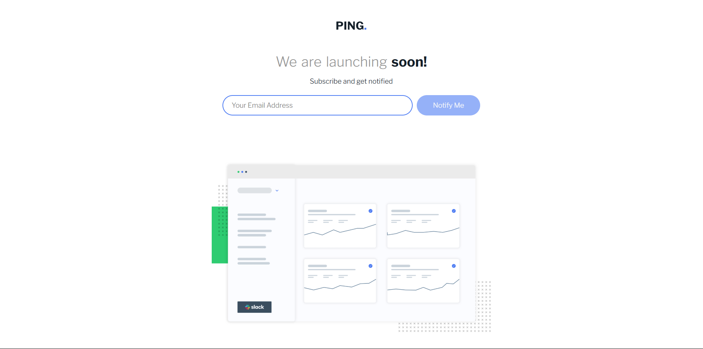

# Frontend Mentor - Product Ping coming soon

This is a solution to the [Frontend Mentor](https://www.frontendmentor.io) challenge: Ping coming soon.



## Table of Contents

1. [Overview](#overview)
2. [Built With](#built-with)
3. [Usage](#usage)
4. [Getting Started](#getting-started)
5. [Acknowledgements](#acknowledgements)

## Overview

This project is a Ping coming soon where users can enter their email address, and we will notify them when the product becomes available.

### The challenge

Create a Ping coming soon signup form where users can submit their email address to receive an email when the product is live.

## Built With

- **HTML**
  - Basic tags
  - Semantic tags
  - `<dialog>` tag (new in HTML)
- **CSS**

  - Basic styling
  - Valid and invalid pseudo-classes (`:valid`, `:invalid`)

- **JavaScript**
  - To handle user interactions and form validation

## Usage

To view the project in action, open `index.html` in your browser.

## Getting Started

To get a local copy up and running, follow these steps:

1. Clone the repository:
   ```
   sh
   git clone https://github.com/abhi-zero/ping-coming-soon-page.git
   ```
2. Navigate to the project directory:
   ```
   cd ping-coming-soon-page
   ``` 
3. Open index.html in your browser.

Acknowledgements

- [Frontend Mentor](https://www.frontendmentor.io) for the challenge.
- [YouTube video on the `<dialog>` tag](https://www.youtube.com/watch?v=ywtkJkxJsdg) to learn more about the `<dialog>` tag.
